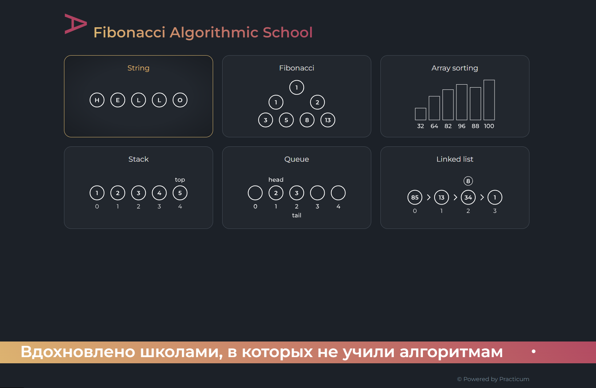
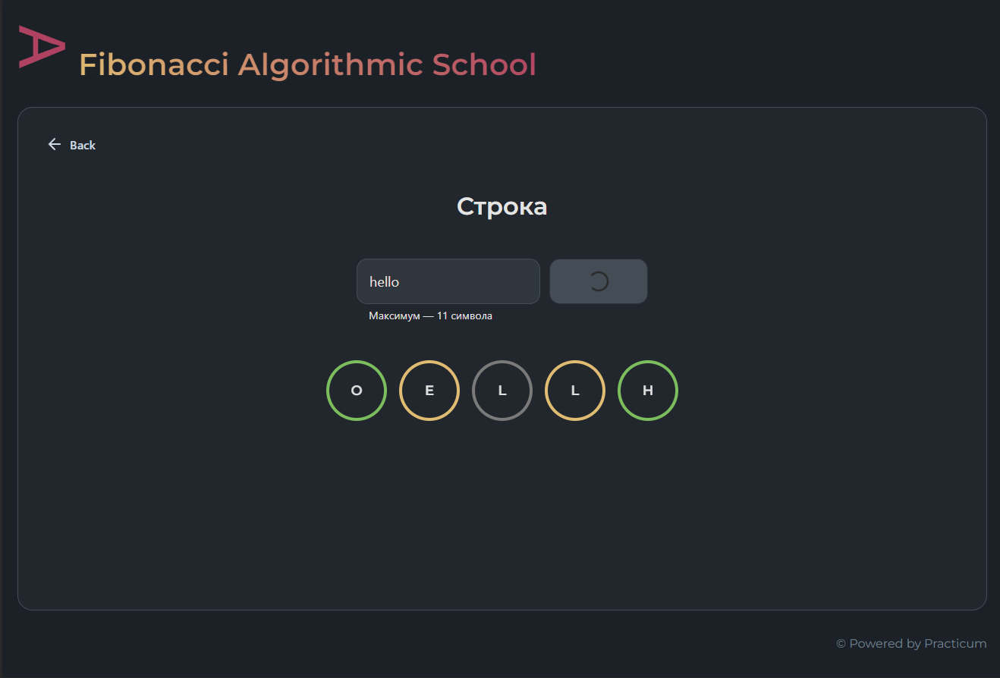
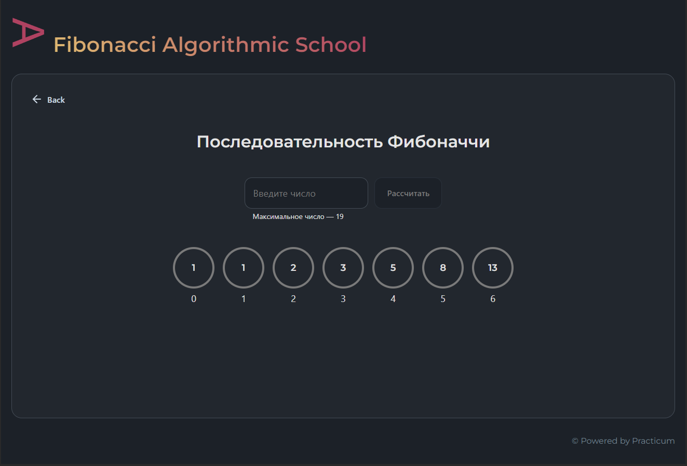
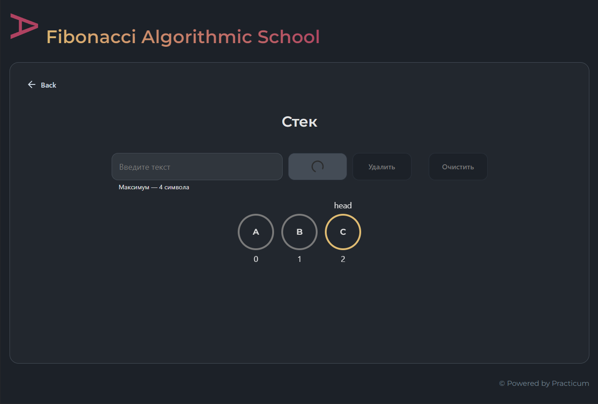
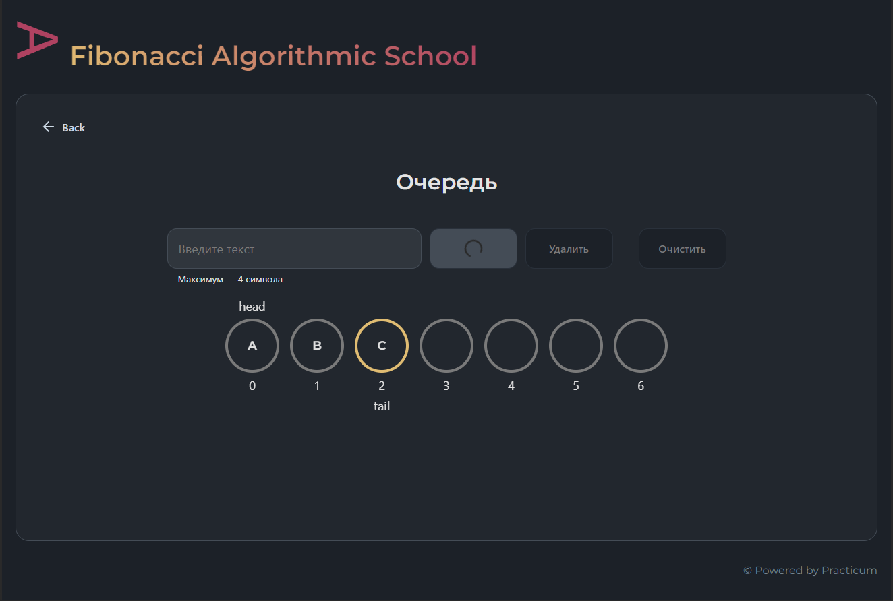
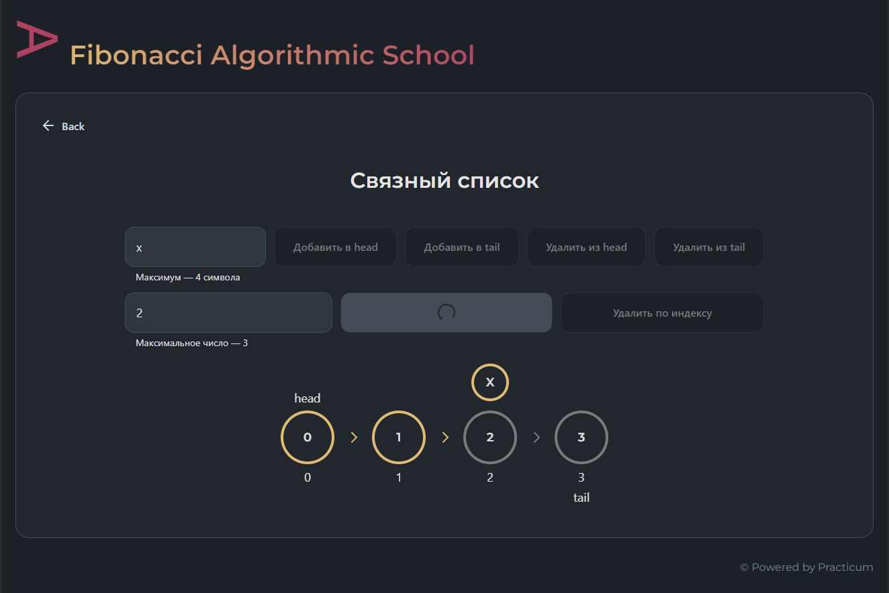
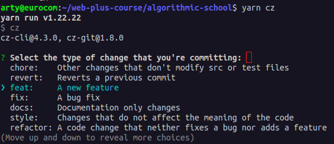
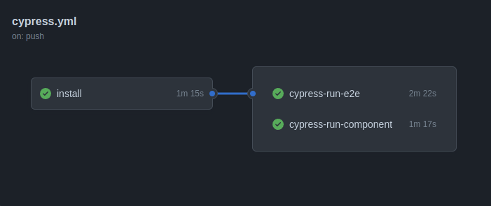

<div align="center">
  <a href="https://github.com/gvozdenkov/algoschool/actions/workflows/cypress.yml">
    
  </a>
  <a href="http://commitizen.github.io/cz-cli/">
    
  </a>
  <a href="http://commitizen.github.io/cz-cli/">
    
  </a>
</div>

<br />
<div align="center">
  <a href="https://gvozdenkov.github.io/algoschool/">
    
  </a>
  <br/><br/>
  <p align="center">Algorithms playground</p>
  <br/>
</div>

---

<div align="center">
  <h4><a href="https://gvozdenkov.github.io/algoschool/">Live demo</a></h4>
</div>



|                                             |                                                |                                               |
| :-----------------------------------------: | :--------------------------------------------: | :-------------------------------------------: |
|  |    |  |
|   |  |  |

## О проекте

Учебный проект. Визуализация работы некоторых алгоритмов и структур данных. Я постарался
организовать проект максимально близко к продакшену. Код покрыт тестами, настроены линтеры и CI.

[Дизайн макет](https://www.figma.com/file/RIkypcTQN5d37g7RRTFid0/Algososh_external_link?node-id=0%3A1),
но я изменил цветовую схему на более строгую.

Сайт корректно отображается на всех размерах экранов.

## Технические решения

### Сборка

Проект собирается с помощью `vite`, потому что `CRA` уже не рекомендовался для создания нового
проекта React. Запуск с [помощью докера](#local-development-with-docker)

### Архитектура

- Использовал относительо новую, но набирающую популярность, методологию
  [FSD](https://feature-sliced.design/ru/docs/get-started/overview) для организации кода фронтенда.

- Использую новый `React Router v6` и ленивую загрузку роутов.

### Pre-commit actions

1.  `ESLint` и `Stylelint` проверяют `TS/SCSS` staged файлы.
2.  `Prettier` автоматически форматирует код.
3.  Запускаются все тесты `jest`
4.  `Commitlint` проверяет коммит на соответствие
    [Conventional Commits](https://www.conventionalcommits.org/en/v1.0.0/). Можно пошагово создать
    корректное сообщение коммита с помощь cli `commitizen`: скрипт `yarn cz`
    <br><br>

Если любой из этапов не проходит, коздание коммита отменяется. Это минизирует попадание ошибочного
кода в коммит и унифицирует сообщения коммитов.

### Тестирование

Код покрыт тестами:

- юнит-тесты `jest` для проверки работы алгоритмов.
- e2e тесты `cypress` для проверки правильной визуализации всех страниц.
- тесты компонентов React с помощью `Cypress Component Testing`. Отностиельно новый инструмент для
  разработки и тестирования компонентов.

Настроена интеграция с `cypress cloud` для визуализации и мониторинга результатов тестирования.

### CI

1. Настроил `github workflow` для запуска всех тестов при пуше в любую ветку, кроме `main`. Разделил
   стадию билда от тестов, чтобы оптимизировать прогон тестов.
   <br><br><br><br>
2. Защитил ветку `main` от прямого пуша. Обновить ветку `main` можно только через PR. Причём должны
   обязательно успешно завершиться все `actions` по тестированию в рабочей ветке. Таким образом
   нерабочий код не может (_но это не точно_) попасть в `main`.
3. Настроил автоматическую публикацию сайта на `gh-pages` при вливании PR в `main`.

## Tech stack

- React with TS
- SCSS
- Vite bundler
- Jest
- Cypress

## Local Development with Docker

```bash
git clone git@github.com:gvozdenkov/algoschool.git
cd algoschool
docker compose -f compose.dev.yaml up

# or use Makefile
make run-dev

# open http://localhost:3010

# create new branch and work in it. Merge to main only via PR

```

## Local Development

use node 18 and above

```bash
git clone git@github.com:gvozdenkov/algoschool.git
cd algoschool
yarn

# or npm install
yarn dev
# or npm run dev

# open http://localhost:5173
```

| script           | Description                                                                                                              |
| ---------------- | ------------------------------------------------------------------------------------------------------------------------ |
| `dev`            | Запускает vite dev server без `cypress`                                                                                  |
| `dev-ct`         | Запускает vite dev server и `cypress open --component` для разработки и тестирования компонентов                         |
| `dev-e2e`        | Запускает vite dev server и `cypress open --e2e` для e2e тестирования                                                    |
| `build`          | билд проекта                                                                                                             |
| `lint`           | проверки `eslint`                                                                                                        |
| `typecheck`      | проверка typescript компилятором `tsc`                                                                                   |
| `prettier:write` | исправляет ошибки форматирования                                                                                         |
| `prettier:check` | проверяет ошибки форматирования (используется в CI перед тестами cypress.yaml)                                           |
| `stylelint:fix`  | `stylelint` исправляет .scss стили                                                                                       |
| `test:cy`        | запуск всех тестов `cypress`                                                                                             |
| `test:jest`      | запуск всех тестов `jest`                                                                                                |
| `cz`             | cli утилита для созадния коммита по рекомендациям [Conventional Commits](https://www.conventionalcommits.org/en/v1.0.0/) |

## Дальнейшие планы

1. Добавить [линтер](https://github.com/feature-sliced/steiger) для методологии
   [FSD](https://feature-sliced.design/ru/docs/get-started/overview)
2. Перевезти проект на [Remix.run](https://remix.run/) фреймворк. Лучше CEO, быстрее индексация.
3. Внедрить `Storybook` для разработки и тестирования компонентов в изоляции. Уже добавлены
   зависимости и скрипты запуска. Но пока там пусто.

<details>
<summary>Workflow setup details</summary>

### Lint staged files

Used `husky` & `lint-staged` packages to lint & format staged files only

```sh
# .husky/_/pre-commit
yarn lint-staged && yarn test:jest -o

```

`.lintstagedrc.json` setup sequential running commands for .js|ts|jsx|tsx files in order of array
items

```json
{
  "*.(js|ts|jsx|tsx)": ["yarn prettier:write", "yarn lint"],
  "*.md": "yarn prettier:write"
}
```

### Commit messages

This project is [Commitizen](https://www.npmjs.com/package/commitizen?activeTab=readme) friendly. So
you can easy create commits in a step by step guide by run:

If you are mannually create commit message it will be linted with `commitlint` to lint commit
messages acording with [Conventional Commits](https://www.conventionalcommits.org/en/v1.0.0/).

```bash
yarn cz
# or
npm run cz
```

Commitizen & commitlint setup:

1. Used ligthweight `cz-git` adapter for `commitizen` to generate cli interface for `yarn cz`
2. Setup `cz-git` with `.czrc` file
3. Setup `commitlint` with `commitlint.config.ts`

```json
"devDependencies": {
  "@commitlint/cli": "^18.4.3",
  "@commitlint/config-conventional": "^18.4.3",
  "@commitlint/format": "^18.4.3",

  "commitizen": "^4.3.0",
  "cz-git": "^1.8.0",
}
```

### Code formating

Used Prettier (exact 2.8.7 version) for formatting and Eslint for linting only. So setup

```json
"devDependencies": {
  "eslint": "^8.53.0",
  "prettier": "2.8.7",
  "eslint-plugin-prettier": "4.2.1",
  "eslint-config-prettier": "^9.0.0",
}
```

Settup eslint to highlight style errors with prettier:

```cjs
// .eslintrc.cjs
module.exports = {
  // ...
  extends: [
    'eslint:recommended',
    'plugin:@typescript-eslint/recommended-type-checked',
    // ...
    // prettier must be the last in extends
    'prettier',
  ],
  // ...
  plugins: ['prettier'],
  rules: {
    'prettier/prettier': ['error'],
    // ...
  },
};
```

Setup CI to check code formating

```yaml
# cypress.yaml

- run: yarn lint

# only check format, not write
- run: yarn prettier:check
```

Import order sorting:

Used `prettier-plugin-sort-imports` package for prettier to format order of imports

```js
//https://chriscoyier.net/2022/08/09/javascript-import-sorting/

// .prettierrc
"importOrder": [
    "react",
    "<THIRD_PARTY_MODULES>",
    "^(#shared/(config|constants|types|hooks|lib)).*$",
    "^(#shared/ui).*$",
    // Any local imports that AREN'T styles.
    "^(\\.|\\.\\.)/(.(?!.(css|scss)))*$",
    // Styles
    ".(css|scss)$"
  ],
  "importOrderSeparation": true,
  "importOrderSortSpecifiers": true,
  "importOrderCaseInsensitive": true,
```

### Stylelint `.scss`

1. Install:

```bash
yarn add -D stylelint stylelint-config-standard-scss stylelint-config-prettier-scss stylelint-config-clean-order
```

2. Setup stylelint `.stylelintrc.json`:

```json
{
  "extends": [
    "stylelint-config-standard-scss",
    "stylelint-config-clean-order/error",
    "stylelint-config-prettier-scss"
  ],
  "rules": {
    "selector-class-pattern": "^(?:[a-z][a-z0-9]*)(?:(__|_|-)[a-z0-9]+)*$",
    "scss/at-extend-no-missing-placeholder": null
  }
}
```

`selector-class-pattern` to check BEM style names

3. Add script in `package.json` to lint and autofix fixable issues

```diff
+ "stylelint:fix": "stylelint '**/*.scss' --fix",
```

4. Edit `.lintstagedrc.json` to automatic fix all fixable style issues in pre-commit acion

```diff
{
  "*.(js|ts|jsx|tsx)": ["yarn prettier:write", "yarn lint"],
  "*.md": "yarn prettier:write"
  # suddenly `yarn stylelint:fix` don't work:( it crash lint-staged with empty-commit error
+ "*.{css,scss}": "stylelint '**/*.scss' --fix",
}
```

5. Setup VS Code `settings.json` to autofix stylelint issues on save

Install official Stylelint extenstion!

```diff
+  "editor.codeActionsOnSave": {
+     "source.fixAll.stylelint": true
+  },
+  "css.validate": false,
+  "scss.validate": false,
+  "less.validate": false,
+  "stylelint.validate": ["css", "less", "postcss", "scss"],
+  "stylelint.config": null, //use settings from .stylelintrc.json
```

</details>
